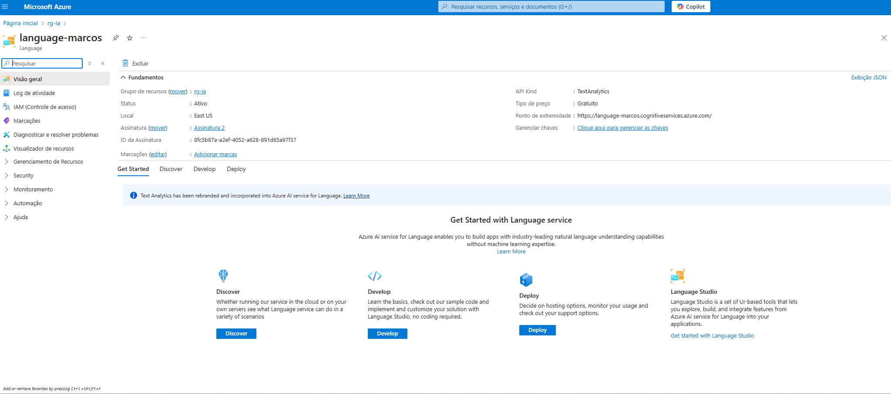
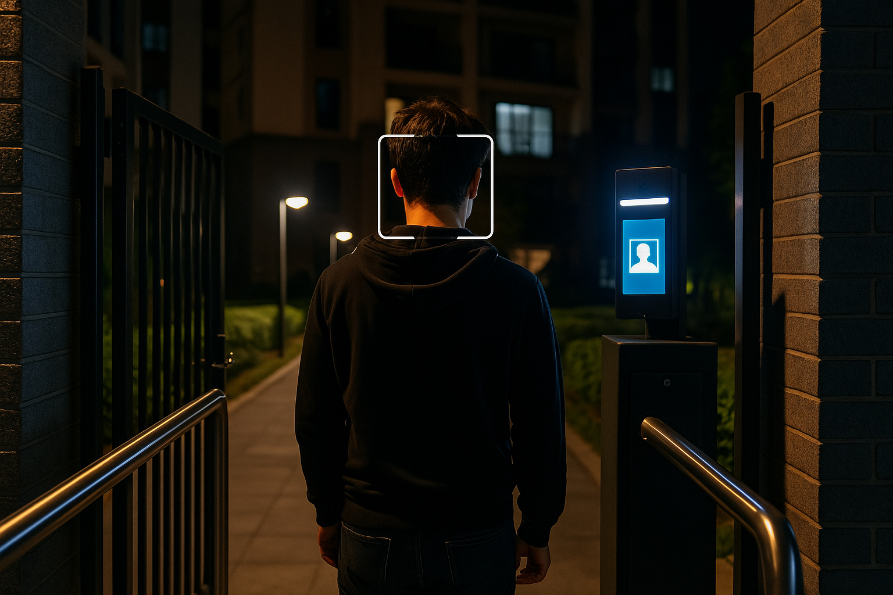

# Projeto: Azure Speech to Text + Análise de Sentimento

Este projeto utiliza os serviços do Microsoft Azure para:
-  Transcrever áudio em texto com **Speech to Text**
-  Realizar análise de sentimento no texto com **Text Analytics (Language Service)**

---

##  Requisitos e configuração

1. **Conta Azure ativa** (https://portal.azure.com)
2. Criar um recurso do tipo `Speech` e outro do tipo `Language`
3. Copiar:
   - Chave da Speech (KEY)
   - Chave da Language
   - Endpoints de ambos os serviços

---

##  Notebook e arquivos usados

- `azure_speech_text_sentiment.py` (código original exportado do Colab)
- `audio.wav` (teste de áudio com voz real)
- Pasta `imagens/` com prints do processo

---

##  Etapas realizadas

### 1. Criar recursos no Azure


### 2. Acessar chave e endpoint da Speech


### 3. Inserir as variáveis no notebook
```python
speech_key = "SUA_SPEECH_KEY"
speech_region = "eastus"
language_key = "SUA_LANGUAGE_KEY"
language_endpoint = "https://SEU_ENDPOINT.cognitiveservices.azure.com/"
```

### 4. Rodar notebook no Google Colab


### 5. Rodar teste com áudio
- Frase: `hoje o clima está muito bom`
- Resultado: positivo


### 6. Teste com áudio alertando problema
- Frase: `tem cachorro solto na área comum, socorro alguém caiu da escada`
- Resultado inesperadamente: positivo


### 7. Erro comum: arquivo em formato incorreto
- Extensão `m4a` não suportada
- Solução: exportar corretamente com Audacity


### 8. Repositório no GitHub criado


---

## 🚫 Dificuldades encontradas
- Confusão com os formatos de áudio
- Endpoint Speech e Language trocados
- Esquecer de remover linha `texto = "exemplo"` após gerar texto pelo áudio
- Comando `ls` não funciona no Windows CMD

---

## 📅 Conclusão

Projeto concluído com sucesso!
Aprendemos:
- Como usar serviços cognitivos do Azure
- Como transcrever e analisar fala em Python
- Subir projeto completo no GitHub

---

## 🔎 Visão Computacional no Condomínio

Complementando o projeto, foram testadas **imagens simulando situações reais** em áreas comuns do condomínio, usando os serviços de análise de imagem (OCR, detecção de objetos e pessoas) do Azure Cognitive Services.

Imagens analisadas:

| Situação | Imagem |
|---------|--------|
| Pessoa em área restrita |  |
| Animal solto em área comum |  |
| Agressão ou gritos com animal |  |
| Briga entre moradores |  |
| Veículo fora da vaga |  |
| Entrada de entregador |  |
| Entrada à noite com reconhecimento facial |  |

---

## 📁 Estrutura do repositório

```
speech-text-sentiment-azure/
├── azure_speech_text_sentiment.py
├── audio.wav
├── README.md
└── visao-computacional/
    └── inputs/
        ├── entrada_condominio_noite.jpg.png
        ├── ...
```

---

## 🔗 Repositório
https://github.com/marcosgaia/speech-text-sentiment-azure
